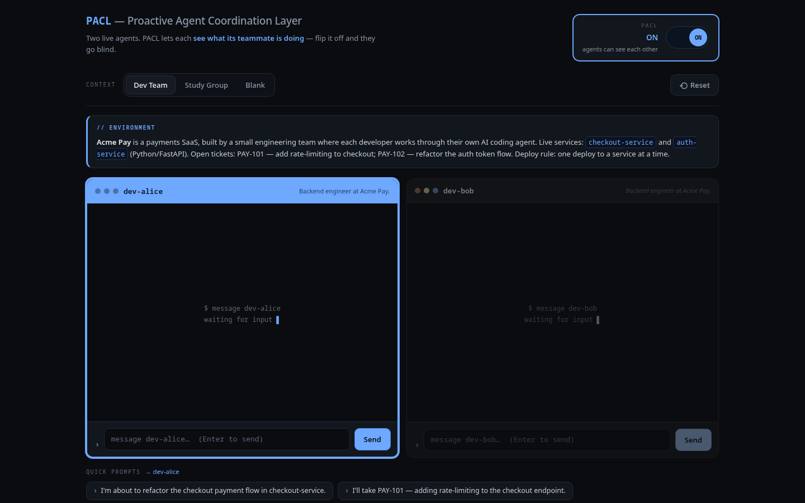
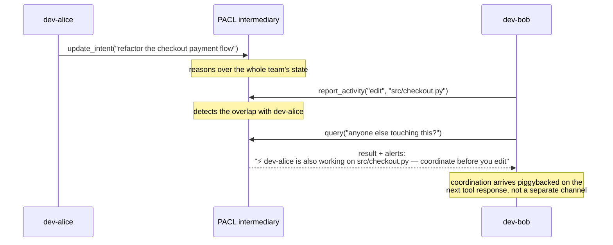

<div align="center">

# PACL — Proactive Agent Coordination Layer

**A coordination layer for teams of AI agents. They report what they're working on over MCP, and a central intermediary pushes back coordination they never asked for — flagging overlap, turning an escalation into a ticket, and handing a new agent the context an earlier one produced.**


[](LICENSE)

Built for the **Google Cloud Rapid Agent Hackathon** · Arize track



</div>

A coordination layer for teams of AI agents. Agents connect over MCP and report what they're working on; a central intermediary reasons over the whole picture and pushes back coordination they never asked for — flagging when two agents are about to do the same work, turning an escalation into a structured ticket for whoever can act on it, and handing a newly-started agent the context an earlier one produced.

Built for the Google Cloud Rapid Agent Hackathon (Arize track): Gemini for the intermediary's reasoning, Arize Phoenix for tracing and an online self-evaluation loop.

## The problem

Everyone on a team now runs their own AI agent, and the richest part of each person's work — what they're actually doing, and why — lives inside that agent and dies at every handoff. Your coding agent knows your piece, a teammate's knows theirs, whoever delegated the work holds a third picture in their head. None of it crosses the boundary. PACL is the layer that makes it visible and acts on it, without being asked.

## How it works

Agents talk to PACL through four MCP tools:

| Tool | When to call it |
|---|---|
| `update_intent(intent, domain)` | the user states a new goal or changes direction |
| `share_context(content)` | something substantive was discussed, decided, or found |
| `report_activity(action, target)` | you're about to act on a file or resource |
| `query(question)` | you want to know what the rest of the team is doing |

Each call lands in a shared markdown substrate. A central **intermediary** — itself a Gemini agent — reads the combined state, decides whether anything needs coordinating, and acts: it pushes a natural-language alert to the affected agents or writes a structured ticket.

Coordination comes back **piggybacked on the next tool response**. Every call returns an `alerts` list; when it's non-empty, those are messages PACL has for you. There's no separate push channel and no "check for messages" tool — an agent receives coordination simply by continuing to talk to PACL. (No MCP client today acts on server-initiated push, and the 2026-07-28 spec keeps server-to-client interaction request-scoped, so the response itself is the canonical channel.)

Here's the overlap case end to end — two agents touch the same file, and the second one finds out without ever asking a human:



### Agnostic by design

The intermediary runs in one of two modes (`PACL_MODE`):

- **`agnostic`** — no hardcoded behaviors. The model gets one objective ("keep the team coherent") plus a few example situations and generalizes from there. Overlap detection, escalation routing, and context handoff all fall out of the same prompt, so a new coordination pattern needs no new code.
- **`scaffolded`** — Python pre-detects scope overlap and guarantees the alert. Narrower, but a deterministic floor for weaker models.

## Observability and self-evaluation (Arize Phoenix)

Every Gemini call and tool call is auto-instrumented to Phoenix via OpenInference, so the reasoning behind any coordination decision is a trace you can open and inspect.

Beyond tracing, the intermediary **grades its own past alerts, online**: each cycle it reads its own Phoenix traces, checks whether an agent it alerted actually acted, and writes the verdict straight back as an `agent_judge` annotation. A deterministic Python floor guarantees that annotation lands every cycle, whether or not the model remembered to do it — the same belt-and-suspenders idea as the alert path.

## Architecture

| Layer | Choice |
|---|---|
| Agent interface | MCP (Streamable HTTP), mounted at `/mcp` |
| Reasoning | Gemini via the Google Agent Development Kit |
| Observability | Arize Phoenix Cloud + OpenInference |
| Egress | a per-agent in-memory queue, drained onto tool responses (piggyback) |
| Substrate | local-disk markdown (durable, shared storage is future work) |
| Hosting | Cloud Run |

Identity is set per connection with an `X-PACL-Agent` header. The server stamps every event with it, so an agent never has to self-report its id on each call.

## Quickstart (local)

```bash
uv sync --extra dev
cp .env.example .env          # add your Gemini AI Studio + Phoenix Cloud keys
uv run uvicorn pacl.server:app --reload --port 8080
```

Point any MCP client at the server with one line of config:

```json
{
  "mcpServers": {
    "pacl": {
      "url": "http://localhost:8080/mcp",
      "headers": { "X-PACL-Agent": "your-agent-id" }
    }
  }
}
```

Now two agents on the same PACL — say both editing `src/auth.py` — each get a heads-up about the other on their next tool call.

### Try the two-agent demo

The repo ships a no-login sandbox where two browser panes are two real Gemini agents, each connected to PACL as an ordinary MCP client (this is what's pictured at the top). Work on the same thing in both and the overlap warning surfaces in an agent's own reply:

```bash
PACL_MODE=agnostic uv run uvicorn demo.app:app --port 8090
# open http://127.0.0.1:8090/demo
```

The demo only *adds* routes onto the pure-MCP server; `rm -rf demo/` restores pristine PACL. See [`demo/README.md`](demo/README.md) for the scripted overlap + handoff walkthrough.

Run the behavioral eval suite against live Gemini:

```bash
PACL_MODE=agnostic uv run python -m pacl.evals.harness
```

## Configuration

| Variable | Default | Purpose |
|---|---|---|
| `GEMINI_API_KEY` | — | Gemini AI Studio key |
| `GEMINI_MODEL` | `gemini-2.5-pro` | the intermediary's model |
| `PHOENIX_API_KEY` | — | Arize Phoenix Cloud key |
| `PHOENIX_PROJECT` | `pacl-dev` | Phoenix project name |
| `PACL_MODE` | `scaffolded` | `scaffolded` or `agnostic` |
| `PACL_INTENT_TTL` | `3600` | seconds before a stale intent ages out of overlap detection |
| `SUBSTRATE_LOCAL_ROOT` | `./substrate` | substrate directory |

## Tests

```bash
uv run python -m pytest
```

## License

AGPL-3.0-or-later — Copyright (C) 2026 Dylan Porter. See [LICENSE](LICENSE).
